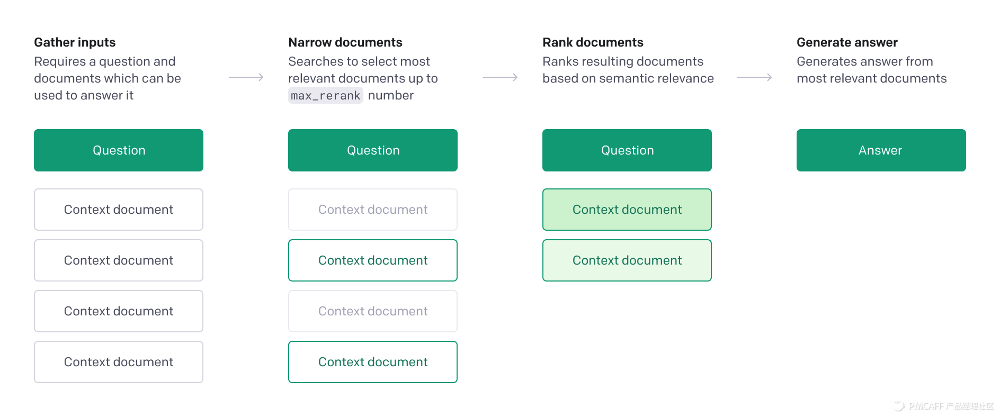

[Spinning Up 项目简介](https://spinningup.readthedocs.io/zh_CN/latest/user/introduction.html)这个是一个热心网友翻译的，[英文原版]( https://spinningup.openai.com/en/latest/index.html)。Spinning Up 是大名鼎鼎的Open AI推出的免费强化学习教学项目。不仅提供了详细的理论介绍，同时还有完整的练习代码，真的不不愧是学习深度强化学习的良心之作。

[源代码](https://github.com/openai/spinningup)


## macbook intel 安装

准备python环境

```
conda create -n spinningup python=3.6
conda activate spinningup

```

安装 OpenMPI

```
brew install openmpi


```


安装spinningup

```
git clone https://github.com/openai/spinningup.git
cd spinningup
pip install -e .
```

命令行启动

spinup/run.py直接启动，`python -m spinup.run [algo] [experiment flags]`


 设置命令行参数

参数使用前都会先过一下eval，所以可以采用dict的方式传参数`--key dict(v1=value_1, v2=value_2)` 相当于`--key:v1 value_1 --key:v2 value_2`

在脚本引入运行

所有算法都可以直接引入运行`from spinup import ppo`


## macbook m1 arm64

以前在x86cpu上可以，今天在arm64没法安装python3.6，然后pip install -e . 失败。


下载 miniConda x86版，安装完后就可以了。


## **Model Family**

GPT-3的四个基础模型：

- Davinci：功能最全、通用能力最强的一个模型；
- Curie: 相比Davinci更快的通用模型；
- Babbage: 更偏向简单、直接任务的模型，规模更小一些‘；
- Ada: 轻量级的模型，推理速度最快，也最便宜；

| Base Model |                    特点                     |                 典型应用                 |
| :--------: | :-----------------------------------------: | :--------------------------------------: |
|  Davinci   |            功能最全，通用性最强             |       意图识别，因果分析，总结任务       |
|   Curie    | 相比Davinci更快，在问答、情感分析方面更擅长 |   语言翻译，多分类，情感分析，总结任务   |
|  Babbage   |         擅长简单任务及内容审核服务          |       内容审核，语义搜索，分类任务       |
|    Ada     |              轻量级的通用模型               | 文本生成，简单分类，地址纠错，关键词提取 |


# **API的调用**

**所有模型都需要被统一的API调用**

调用模型的一些小建议：

1、可以先使用Davinci跑出一个完整的结果；

2、基于Davinci的结果，根据任务类型，同时对比其他几个基础模型的输出，找到投资收益最高的那个模型 - OpenAI官方提供了一个比较工具可以使用 https://gpttools.com/comparisontool;

3、选择好模型之后，在一定时间内保持一个模型对应一个任务，以尽可能地确保服务正常（你知道的，AI有可能告诉你预期之外的结果）和较低的维护成本；


用户可以通过以下的方法来请求API，得到推理结果：

- **CLI Request:** 在命令行中返回推理结果，适合试验或者任务量较少的情况；

- **Python Libraries:** 用户通过官方提供的Openai包，结合自己的API Key调用;

- Community libraries: 

  平台上的开发者自发地根据需要开发了其他语言和环境的调用方法，支持的环境如下：

  - C#
  - Crystal
  - Dart
  - Go
  - Java
  - JS
  - Python
  - Ruby
  - Unity
  - Unreal Engine

> **这里有一点要注意的是，GPT-3的训练数据截断到了2019年的10月份，对于时间敏感的任务，有可能出现模型还没有学到的知识，所以结果会有衰减甚至不可用的情况。**


# **下游应用能力**

在下游的场景支持方面，GPT-3 归纳了四种能力，用户可以将自己面对的任务或者需求转化成以下的其中一类或者几类问题做解决：

## **Completion**

文本作为输入的Prompt，模型将完成在上下文和模型上符合前文的文本结果返回，帮助用户实现一个完整的语句或者段落的生成。

这里面，比较重要的是给模型的Prompt的设计，GPT-3官方给到了一下的几个建议：

- Showing not Telling：给例子，让模型模仿效果要比告诉它做什么好；
- Collect Quality Data：老生常谈了；
- 参数设置：在不同的模型里面，不同参数需要更精巧的设计（已经比较傻瓜化了），比如关键的temperature和top-p这些参数，可能左右模型输出的发散程度；

## **Classify Text**


典典型的文本分类问题，需要输入的是带有标签的数据集，模型在Few-Shot的环境下，输出分类的结果。


**Semantic Search**


目前可以支持用户上传多个不超过150MB的文件，将搜索的结果Top-K返回，这个搜索猜测后面会结合DALLE这样其他模态的能力结果，有可能出现了下一代的搜索引擎的底层技术了。

## **Answer Questions**



Chatbot应用再出山，也许是Chatbot的又一次走向人工不智障的路径。

## **Fine-tuning**

这一部分会是许多算法同学非常关注的部分，Open AI对于Fine-tune的态度看起来是比较谨慎的，需要开发者写邮件申请，通过了之后才有可能对不同的下游任务做自己的定制开


# **场景支持**

在基础模型的能力之上，Open AI进一步封装了他们看起来可以向上延伸的场景模型，这一次主要有三个方向：

- Instruct series(**davinci-instruct-beta and curie-instruct-beta**)：指令返回类型，类似于问答场景，用户输入一段需要模型完成或者解释的任务，模型返回对应的合理结果，不擅长搜索、长文本的生成任务；
- Codex series(**davinci-codex and cushman-codex,** Private beta)：生成代码类型，包括从自然语言生成代码的能力，Python支持的最完善，能够支持的环境包括JavaScript, Go, Perl, PHP, Ruby, Swift, TypeScript, SQL, Shell

- Content Filter(**content-filter-alpha**): 检测文本中的内容，对文本进行分类，主要是三个类别(safe-0, sensitive-1, unsafe-2)

# **Playground**

Playground是Open AI为用户提供的一个最直接可以通过无代码的交互方式使用模型的环境，这是一个B/S的服务，可以直接访问：

[OpenAI Playground](https://beta.openai.com/playground)

# **应用发布**

Open AI对于开发者发布一个使用GPT-3能力的应用也相当保守。他们规定，当这个应用的接口服务超过5个用户时，开发者就必须向Open AI的团队发送一个审查应用的邮件，然后得到官方的认可，否则开发者的API很有可能立即被回收，甚至有永久失效的可能性。

同时，对于应用了性，Open AI也分成了三个等级，有一些应用是不被允许上线的（损害公共利益的、有可能信息泄露的，诸如此类），开发者可以参考比较详尽的[Usage Guidelines](https://beta.openai.com/docs/usage-guidelines)

**一个例外是，如果这个应用只是内部用来Demo或者Hackthon的话，可以提前两周向官方提出申请**

总结来讲，一个应用的发布流程主要如下：

1、确保应用符合Usage Guidelines；

2、再开发自己的应用，注意遵循 [safety best practices](https://beta.openai.com/docs/safety-best-practices)的要求；

3、当开发完整，向官方提交一个预发布的请求；

4、OpenAI在风险、市场、滥用等问题上进行审核；

5、应用得到通过或者拒绝的结果；

6、在应用上线后，随着用户和服务的增长，如有需要，向相关方提出增加资源的请求。


# **价格**

OpenAI在充分地商业化变身后，非常明确地把GPT-3作为新一代的AI基础设施，和云这样的市场类比，这个逻辑同样的应用在了这一次的定价中，具体的定价方式如下：


https://openai.com/api/pricing/

有几个关键点：

- 免费试用: 在用户开始使用的前3个月内，有免费的等价$18的额度；
- Pay as you go: 每1000个Token的阶梯收费;
- 仔细选择模型：在每个任务中，仔细选择模型，计算好ROI；

在定价的逻辑里面，有一个非常重要的概念是Token（技术同学比较好理解）:

用户可以通过这个官方提供的计算Token数量的工具来粗略估计自己需要支出的成本

[OpenAI Tokenizer Tool](https://beta.openai.com/tokenizer)


# **示例应用**

最后，官方给到了一些可以直接使用的例子:

[OpenAI Examples](https://beta.openai.com/docs/examples/summarization)

当然，更多也更有趣的是众多的开发者开脑洞的应用，值得探索借鉴：

[Developer Apps](https://beta.openai.com/examples)


# **一些问题**

- 对中文的支持：以目前开放的状态观察，我们还是看国产模型的吧；
- 想象空间：OpenAI做了吃螃蟹的动作，这个平台的架构日渐强壮，确实值得探索；
- 是不是智障：确实，有时候对于mistake-intolerant的任务来讲，智障的概率有点高，但这取决于开发者对于应用的定位，开放的、生成式的任务会有意思很多；


看一些例子
