参考 [Ivon的部落格](https://ivonblog.com/posts/stable-diffusion-webui-manuals/prompts/general-prompt-guide/)


```
an asian girl on the beach
```

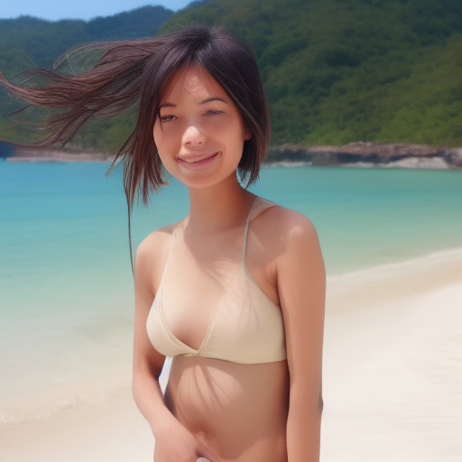

改用新的提示词

```
1girl, asian, beach, ocean
```

然后将batch count改为4

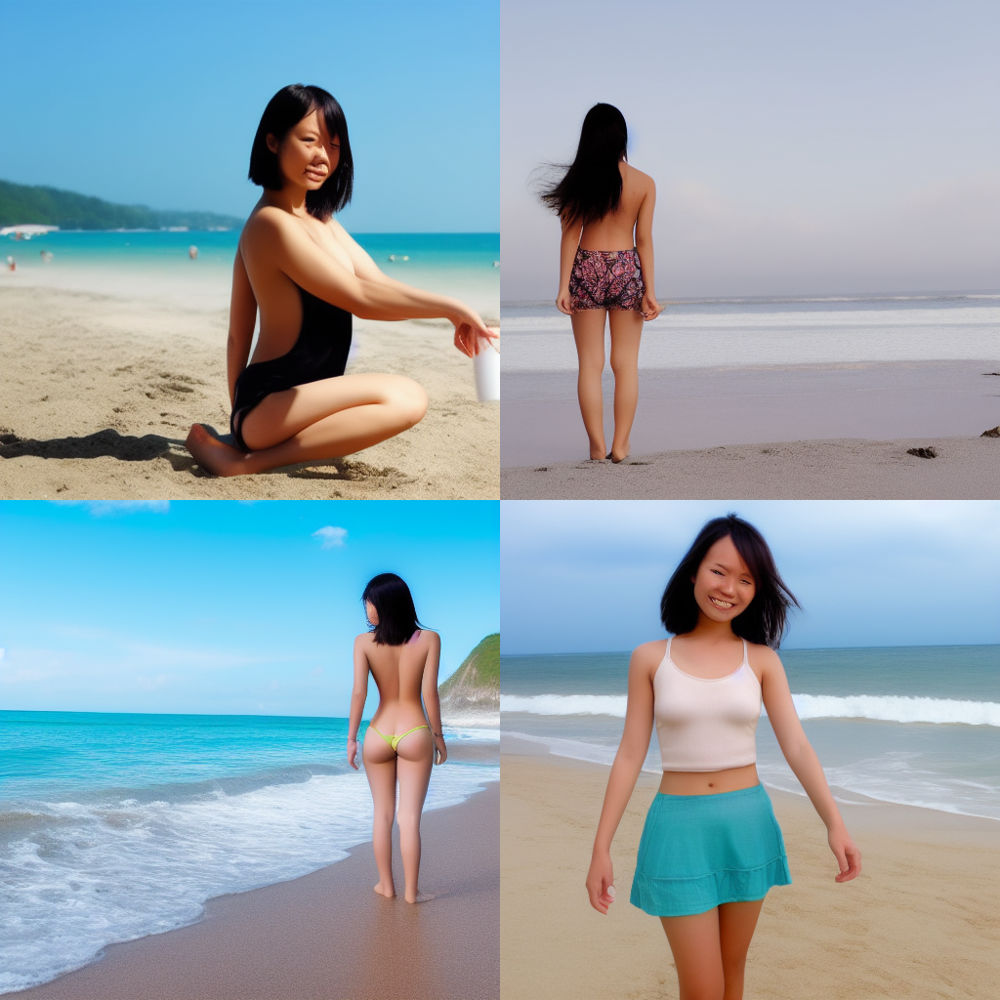


再算一次，但是结果变了？没错，即使提示词相近，AI绘图每次生图结果都是随机的。要维持上一次的结果并微调，你得保留每次算图的种子码(Seed，SD WebUI界面右下角，亦会写在文件名上)。

这时候注意一下右下角的内容

```
1girl, asian, beach, ocean
Steps: 20, Sampler: LMS, CFG scale: 7, Seed: 1655102876, Size: 512x560, Model hash: cc6cb27103, Model: v1-5-pruned-emaonly, Version: v1.7.0
```

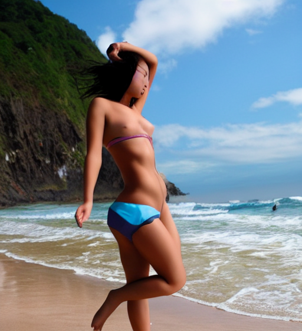

新测试,在seed 处填入：1655102876

```
1girl, asian, blue eyes, short hair, straw hat, standing, blue bikini, beach, ocean, orange sky

Steps: 20, Sampler: LMS, CFG scale: 7, Seed: 1655102876, Size: 512x560, Model hash: cc6cb27103, Model: v1-5-pruned-emaonly, Version: v1.7.0

```

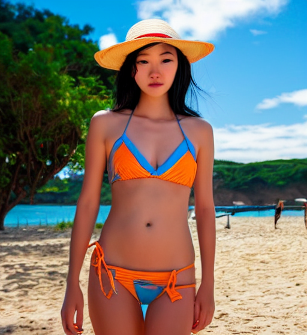

要改变风格，可以在提示词加入「风格」的提示词。这方面的提示词有：相片(photoshop)、3D建模(3d model)、装饰艺术(art deco)、石像(stone sculpture)等风格

```
a stone sculpture of 1girl, asian, blue eyes, beach, ocean
Steps: 20, Sampler: DPM++ 2M SDE, CFG scale: 7, Seed: 1822157101, Size: 512x512,
Model hash: cc6cb27103, Model: v1-5-pruned-emaonly, Version: v1.7.0

Time taken: 14.5 sec.
```

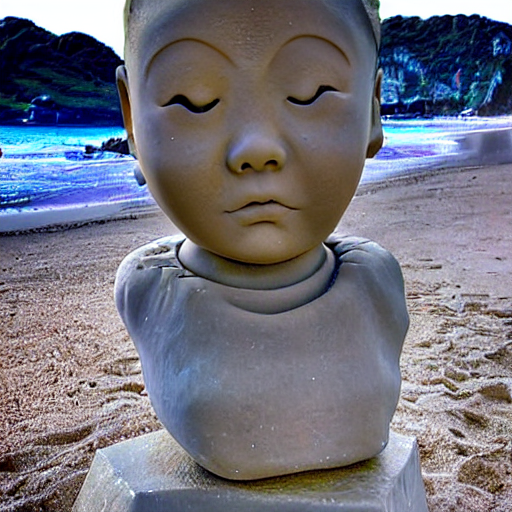

风格是很难界定的东西呢，一般来说我们会图片像哪个艺术家的风格对吧？那么不如直接「召唤」他们吧！提示词可以包含某位画家的名字，AI会尝试模仿其风格。例如加上「慕夏的作品」，并加入「大师级作品」的风格提示词：

```lisp
; 参考翻译：慕夏的作品，大师级作品，一个女孩，亚洲人，蓝眼睛，沙滩，海洋
artwork by Alfons Maria Mucha, masterpiece, 1girl, asian, blue eyes, beach, ocean
```

生图的结果就会变得像是慕夏的作品。顺带一提`masterpiece`这个提示词还蛮万用的，可以让作品维持一定水准。

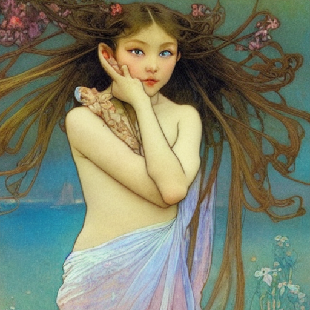

当然还可以画特定动漫人物的「二创」，只要将名字和作品名称打上去就可以了。有名的动漫角色只要出现名字，不用特别指定身体特征就会生成原作风格了，例如指定《新世纪福音战士》的惣流·明日香·兰格雷：

```lisp

asuka_langley_souryuu from neon_genesis_evangelion, masterpiece, 1girl, beach, ocean
```

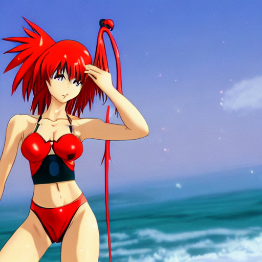

再次提醒，在下提示词的时候，生成图片使用的模型也需纳入考量。譬如想要生成特定动漫人物，去Danbooru找到了英文姓名，加上提示词，但你却用画真人的Stable Diffusion去算，则AI可能根本就不会认得你说的角色是谁，反之亦然。Danbooru的标签风格跟一般图片的描述还是有差距的。

除非日后有搜罗全部网络图片的超大模型出现，否则下提示词须配合模型种类来决定。

如果AI怎样都生成不出你要的风格或人物，请考虑换个模型，或是 [自行训练模型](https://ivonblog.com/posts/stable-diffusion-webui-manuals/zh-cn/training/)。

# 负向提示词 Negative Prompts 

上面我们只写提示词，但下面的负向提示词的字段都是空白。但生图时常常还需要加入一些负向提示词，避免掉不好的结果。AI绘图有时不会一次就算出好结果，所以还需要加上负向提示词来控制，尤其是大批算图的时候更为重要。

负向提示词会加入一些常见的「不好」的图片特征，例如低画质、最糟品质、画家签名、模糊、浮水印

```lisp
deformed, lowres, bad anatomy, text, error, extra digit, fewer digits, cropped, worst quality, low quality, normal quality, jpeg artifacts, signature, watermark, username, blurry, artist name
```

不想看到的东西也可以加进去。例如不想看到裸露、兵器、血、猎奇的元素出现，就加入`nsfw`、`weapon`、`blood`、`guro`至负向提示词

```lisp
nsfw, weapon, blood, guro, lowres, bad anatomy, text, error, extra digit, fewer digits, cropped, worst quality, low quality, normal quality, jpeg artifacts,signature, watermark, username, blurry, artist name
```

提示词并非越多越好，正向提示词以不超过150个词元(token)为原则；不过负向提示词可以尽量把不想看到的都塞进去。

# Stable Diffusion WebUI独有语法

此节列出的语法为AUTOMATIC1111制作的SD WebUI独有，使用其他人制作的Stable Diffusion程序不见得适用。

## 关注度括号 Attention/emphasis

控制关注度的符号，增加算图时对该提示词的关注度(attention)。简单来说，括号就是你想强调的重点元素，括号越多，生成的结果越会符合括号里的提示词。

SD WebUI使用小括号控制关注度： `( )` 小括号层次越多权重越高(不加小括号为1倍，每加一层小括号乘以1.1倍)。例如，强调「蓝眼睛」，生成的结果就更高几率是蓝眼睛人物


```
asuka_langley_souryuu from neon_genesis_evangelion, masterpiece, 1girl, beach, ocean, ((blue eyes))
Steps: 20, Sampler: UniPC, CFG scale: 7, Seed: 1080937815, Size: 512x512, 
Model hash: cc6cb27103, Model: v1-5-pruned-emaonly, Version: v1.7.0

```

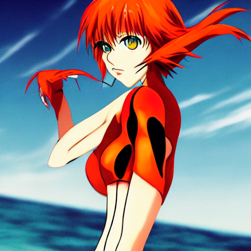


亦可以直接写明要增强几倍关注度，但其实一般情况下不用设太强，用一二层的小括号就够了。

```lisp
asuka_langley_souryuu from neon_genesis_evangelion, masterpiece, 1girl, beach, ocean, ((blue eyes)),((yellow hair))
Steps: 20, Sampler: UniPC, CFG scale: 7, Seed: 2199430340, Size: 512x512,
Model hash: cc6cb27103, Model: v1-5-pruned-emaonly, Version: v1.7.0

```

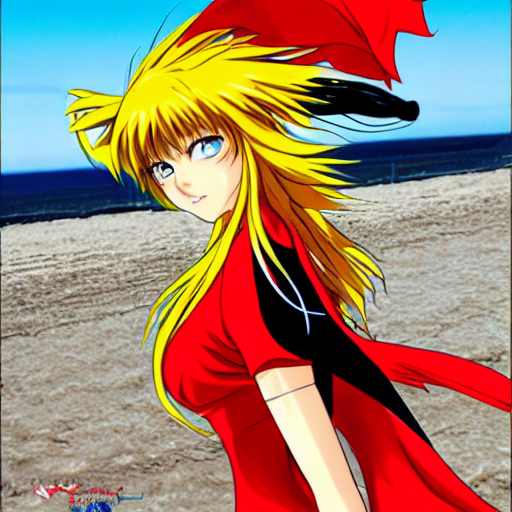


```
asuka_langley_souryuu from neon_genesis_evangelion, masterpiece, 1girl, beach, ocean, ((blue eyes)),((yellow hair)),(Green clothes)
Steps: 20, Sampler: UniPC, CFG scale: 7, 
Seed: 2630536656, Size: 512x512, Model hash: cc6cb27103, Model: v1-5-pruned-emaonly, Version: v1.7.0
```

这时候对颜色的控制已经错乱了，说明提示词混乱了。

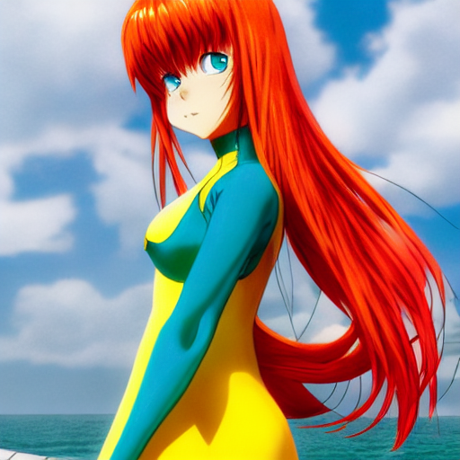


## 提示词编辑 Prompt editing 

指定在到哪一步数的时候切换提示词。此处的中括号跟权重无关。

语法为`[提示词1:提示词2:要切换的步数]`

例如，算图时设置20步，一开始算橘子，设置算到15步时切换成苹果

```lisp
[orange : apple : 15] on table
```

这时候就是生成一个桔子


## 切换单字 Alternating Words

使用`|`代表在每个步数切换提示词，例如我要在算图时于「蓝眼睛」或「红眼睛」或「黑眼睛」之间切换

```lisp
asian, woman, [blue eyes|red eyes|black eyes], beach, ocean
```

## 可组合性扩散 Composable Diffusion

此语法让AI依照权重生成二个不同的对象。

例如生成橘子与苹果，中间用大写的`AND`连接

```lisp
orange AND apple
```

后面加上数字控制权重，初始值为1，数值低于0.1则无效。

```lisp
orange :1.5 AND apple :2.5
```

此语法适合搭配 [ControlNet和Latent Couple](https://ivonblog.com/posts/stable-diffusion-webui-manuals/zh-cn/extensions/latent-couple/)，可以准确控制图中对象的位置。


# 提示词范例 

这里提供一些懒人包。负向提示词有些是通用的。

## 生成可爱的狗勾

让我们试着画几只柯基犬在草地上奔跑。

建议使用模型：Stable Diffusion、Realistic Vision

提示词

```lisp
3 corgi dogs running on grass field
```

负向提示词

```lisp
lowres, bad anatomy, text, error, extra digit, fewer digits, cropped, worst quality, low quality, normal quality, jpeg artifacts,signature, watermark, username, blurry, artist name
```

Steps: 20, Sampler: Euler a, CFG scale: 7, Seed: 2387293181, Size: 512x512, Model hash: cc6cb27103, Model: v1-5-pruned-emaonly, Version: v1.7.0


## 生成高科技未来城市

建议使用模型：Stable Diffusion、Realistic Vision

提示词

```lisp
city future, 8k, exploration, cinematic, realistic, unreal engine, hyper detailed, volumetric light, moody cinematic epic concept art, realistic matte painting, hyper photorealistic
```

负向提示词

```lisp
lowres, bad anatomy, text, error, extra digit, fewer digits, cropped, worst quality, low quality, normal quality, jpeg artifacts,signature, watermark, username, blurry, artist name
```

Steps: 20, Sampler: Euler a, CFG scale: 7, Seed: 299709774, Size: 512x512, Model hash: cc6cb27103, Model: v1-5-pruned-emaonly, Version: v1.7.0


## 生成一台特斯拉车子

建议使用模型：Stable Diffusion、Realistic Vision

提示词

```lisp
concept art,tesla car, aerodynamic, future
```

负向提示词

```lisp
lowres, bad anatomy, text, error, extra digit, fewer digits, cropped, worst quality, low quality, normal quality, jpeg artifacts,signature, watermark, username, blurry, artist name
```

Steps: 20, Sampler: Euler a, CFG scale: 7, Seed: 3821788433, Size: 512x512, Model hash: cc6cb27103, Model: v1-5-pruned-emaonly, Version: v1.7.0


## 生成动漫美少女

建议使用模型：Anything、Hentai Diffusion

随机画一个Fate/Grand Order的贞德

提示词

```lisp
jeanne d'arc from fate grand order, 1girl, (best quality), (masterpiece), (high detail), ((full face)), sharp, ((looking at viewer)), ((detailed pupils)), (thick thighs), (((full body))), (large breasts)
```

负向提示词

```lisp
lowres, bad anatomy, bad hands, text, error, missing fingers, extra digit, fewer digits, cropped, worst quality, low quality, normal quality, jpeg artifacts,signature, watermark, username, blurry, artist name
```

Steps: 20, Sampler: Euler, CFG scale: 7, Seed: 1480416086, Size: 512x512, Model hash: cc6cb27103, Model: v1-5-pruned-emaonly, Version: v1.7.0


## 生成日韩风真人女孩 

建议使用模型：ChilloutMix、Perfect World，并适时使用Japanese Doll的LoRA。

随机画一个日本女孩，不要色色

提示词

```lisp
(a japanese woman), shiny skin, (ultra high res,photorealistic,realistic,best quality,photo-realistic), (((high detailed skin,visible pores))),(real person,photograph), (8k, raw photo, best quality, masterpiece),(1girl),photon mapping, radiosity, physically-based rendering,automatic white balance,(haunting smile,moist lips),watery eyes, (blush|cute and playful|adorable|thick bangs|beauty),((irises and pupils are rounded,the pupil reflects the surroundings,eyes are not the same size))
```

负向提示词

```lisp
nude, lowres,blurry,simple background,jpeg artifacts,bad-artist,bad shadow,compressed image,low pixel,light spot, paintings,sketches,((monochrome)),((grayscale)),noise point,semi-realistic, 3d,render,cg,drawing,cartoon,anime,comic,username,watermark,signature,cropped,error,censored,text,stain, deformed iris,deformed pupils,deformed nail,deformed ear,deformed eye,deformed eyelid,collapsed eyeshadow, [excessive skin spots,excessive skin imperfections,skin blemishes,skin fold,rough skinstain skin],goosebumps,skin layering,axillary fold,facial contortion, (flawless face),trimming
```

Steps: 20, Sampler: DDIM, CFG scale: 7, Seed: 2228126458, Size: 512x512, Model hash: cc6cb27103, Model: v1-5-pruned-emaonly, Version: v1.7.0

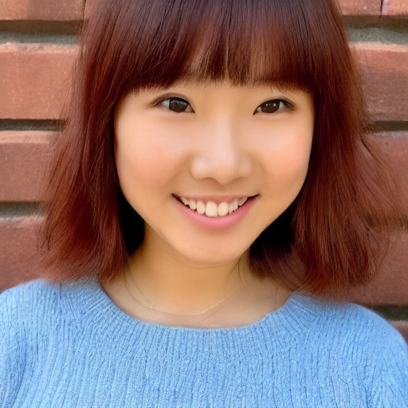


**Prompt:**

`(a japanese woman), shiny skin, (ultra high res,photorealistic,realistic,best quality,photo-realistic), (((high detailed skin,visible pores))),(real person,photograph), (8k, raw photo, best quality, masterpiece),(1girl),photon mapping, radiosity, physically-based rendering,automatic white balance,(haunting smile,moist lips),watery eyes, (blush|cute and playful|adorable|thick bangs|beauty),((irises and pupils are rounded,the pupil reflects the surroundings,eyes are not the same size))`


Steps: 20, Sampler: Euler a, CFG scale: 7, Seed: 1201812112, Size: 512x512, Model hash: 4199bcdd14, Model: revAnimated_v122EOL, Version: v1.7.0

# 5. 值得参考的提示词网站 [#](https://ivonblog.com/posts/stable-diffusion-webui-manuals/zh-cn/prompts/general-prompt-guide/#5-值得参考的提示词网站)

若使用的是SD模型，想生成真人，请看 [Voldy](https://rentry.org/artists_sd-v1-4)整理的历史上有名的艺术家。

若使用动漫风的模型请看 [Danbooru](https://danbooru.donmai.us/)图库的标签决定要下哪些提示词。

[Prompt Generator](https://promptomania.com/stable-diffusion-prompt-builder/)和 [NovelAI魔导书](https://thereisnospon.github.io/NovelAiTag/)可以协助你组合提示词。

[Civitai](https://civitai.com/)除了下载模型外，还有很多现成的提示词搭配模型的范例可以照抄。

