提示词：

`photo realistic, ultra details, natural light ultra detailed portrait of a female necromancer, skeleton face volumetric fog, Hyperrealism, breathtaking, ultra realistic, ultra detailed, cyber background, cinematic lighting, highly detailed, breathtaking, photography, stunning environment, wide-angle`

Negative prompt: `(deformed iris, deformed pupils), text, worst quality, low quality, jpeg artifacts, ugly, duplicate, morbid, mutilated, (extra fingers), (mutated hands), poorly drawn hands, poorly drawn face, mutation, deformed, blurry, dehydrated, bad anatomy, bad proportions, extra limbs, cloned face, disfigured, gross proportions, malformed limbs, missing arms, missing legs, extra arms, extra legs, (fused fingers), (too many fingers), long neck, camera`
Steps: 50, Sampler: Euler, CFG scale: 8, Seed: 2599470049, Size: 512x512, Model hash: cc6cb27103, Model: v1-5-pruned-emaonly, Version: v1.7.0

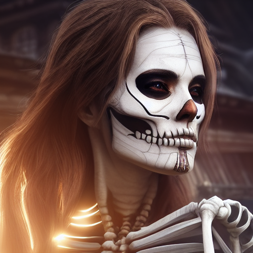

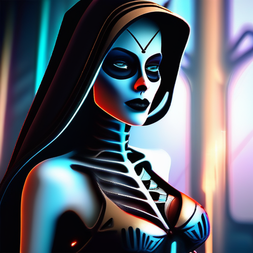

*Steps: 20, Sampler: Euler a, CFG scale: 7.5, Seed: 1453177103, Size: 512x512, Model hash: e6bb9ea85b, Model: sdXL_v10VAEFix, VAE hash: e6bb9ea85b, VAE: sdXL_v10VAEFix.safetensors, Version: v1.7.0*

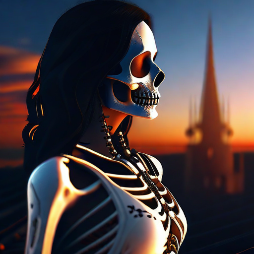

Steps: 20, Sampler: UniPC, CFG scale: 8, Seed: 1453177105, Size: 512x512, Model hash: e6bb9ea85b, Model: sdXL_v10VAEFix, VAE hash: e6bb9ea85b, VAE: sdXL_v10VAEFix.safetensors, Version: v1.7.0

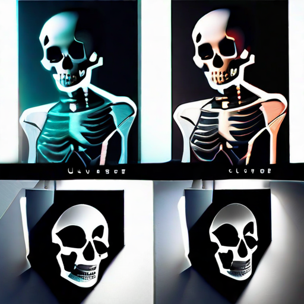

*Steps: 20, Sampler: UniPC, CFG scale: 8, Seed: 1453177105, Size: 512x512, Model hash: e6bb9ea85b, Model: sdXL_v10VAEFix, VAE hash: e6bb9ea85b, VAE: sdXL_v10VAEFix.safetensors, Version: v1.7.0*

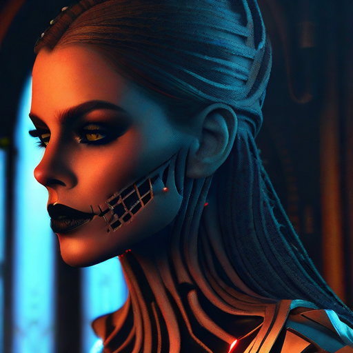

*Steps: 20, Sampler: UniPC, CFG scale: 8, Seed: 1453177107, Size: 512x512, Model hash: e6bb9ea85b, Model: sdXL_v10VAEFix, VAE hash: e6bb9ea85b, VAE: sdXL_v10VAEFix.safetensors, Version: v1.7.0*

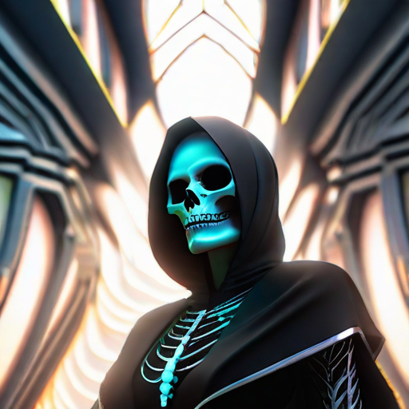

*Steps: 20, Sampler: UniPC, CFG scale: 8, Seed: 1453177108, Size: 512x512, Model hash: e6bb9ea85b, Model: sdXL_v10VAEFix, VAE hash: e6bb9ea85b, VAE: sdXL_v10VAEFix.safetensors, Version: v1.7.0*

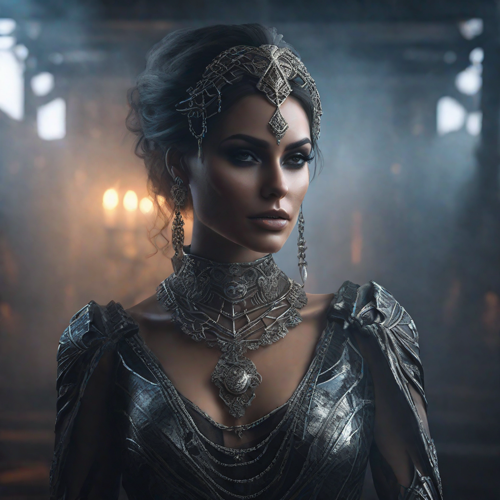

*Steps: 20, Sampler: UniPC, CFG scale: 8, Seed: 333969092, Size: 1024x1024, Model hash: e6bb9ea85b, Model: sdXL_v10VAEFix, VAE hash: e6bb9ea85b, VAE: sdXL_v10VAEFix.safetensors, Version: v1.7.0*

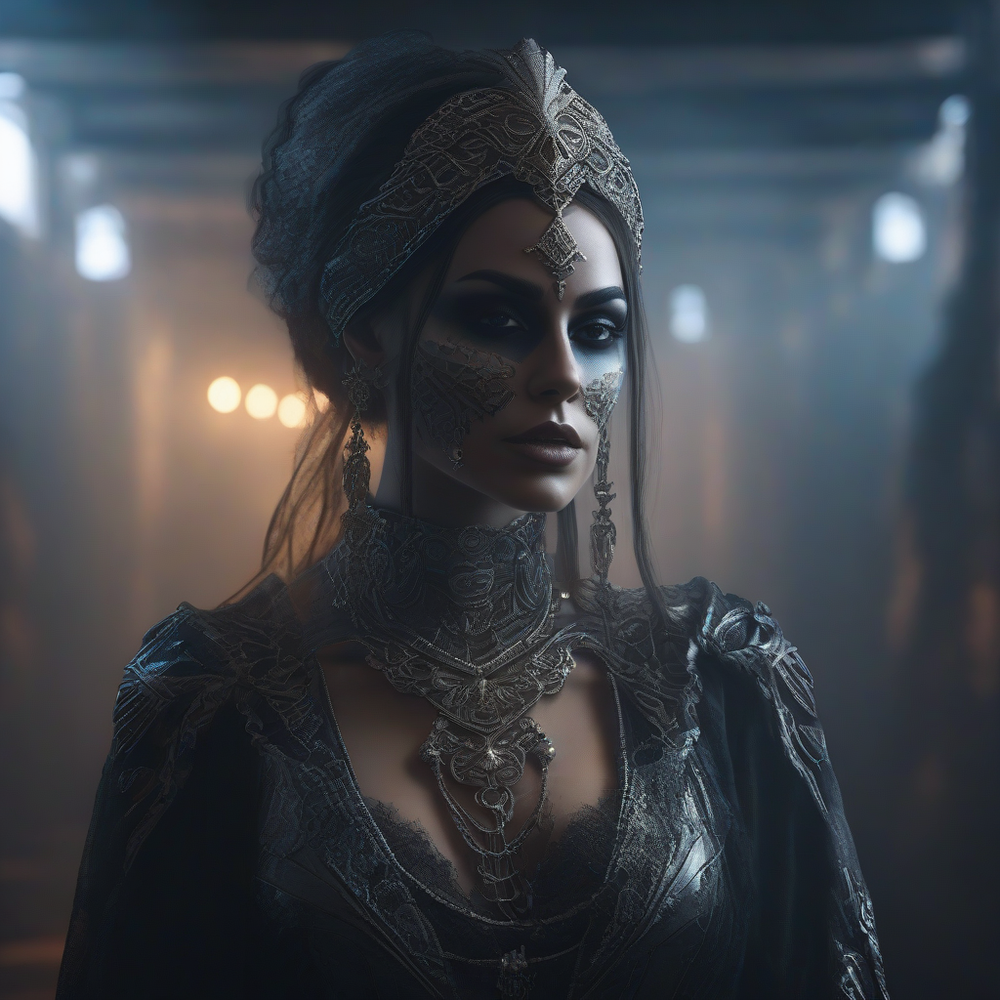

Steps: 20, Sampler: Euler, CFG scale: 8, Seed: 333969092, Size: 1024x1024, Model hash: e6bb9ea85b, Model: sdXL_v10VAEFix, VAE hash: e6bb9ea85b, VAE: sdXL_v10VAEFix.safetensors, Version: v1.7.0

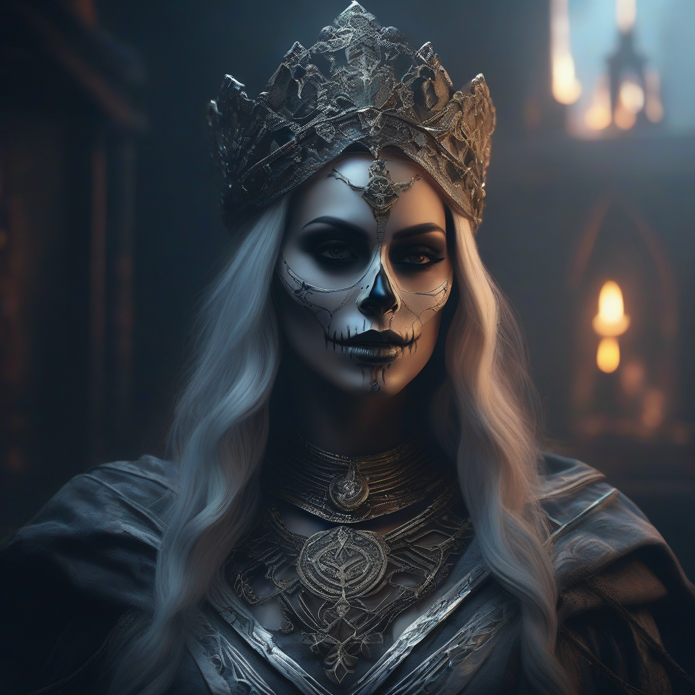

*Steps: 20, Sampler: Euler, CFG scale: 8, Seed: 2378502969, Size: 1024x1024, Model hash: e6bb9ea85b, Model: sdXL_v10VAEFix, VAE hash: e6bb9ea85b, VAE: sdXL_v10VAEFix.safetensors, Version: v1.7.0*

提示词：

`photo of young Chinese woman, highlight hair, sitting outside restaurant, wearing dress, rim lighting, studio lighting, looking at the camera, dslr, ultra quality, sharp focus, tack sharp, dof, film grain, Fujifilm XT3, crystal clear, 8K UHD, highly detailed glossy eyes, high detailed skin, skin pores`

Negative prompt:

`disfigured, ugly, bad, immature, cartoon, anime, 3d, painting, b&w`

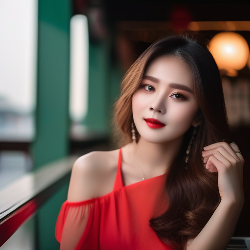

*Steps: 20, Sampler: Euler, CFG scale: 8, Seed: 333969092, Size: 512x512, Model hash: e6bb9ea85b, Model: sdXL_v10VAEFix, VAE hash: e6bb9ea85b, VAE: sdXL_v10VAEFix.safetensors, Version: v1.7.0*

**prompt：**

`photo of young Caucasian woman, highlight hair, sitting outside restaurant, wearing dress, rim lighting, studio lighting, looking at the camera, dslr, ultra quality, sharp focus, tack sharp, dof, film grain, Fujifilm XT3, crystal clear, 8K UHD, highly detailed glossy eyes, high detailed skin, skin pores`

**Negative prompt:**

`disfigured, ugly, bad, immature, cartoon, anime, 3d, painting, b&w`

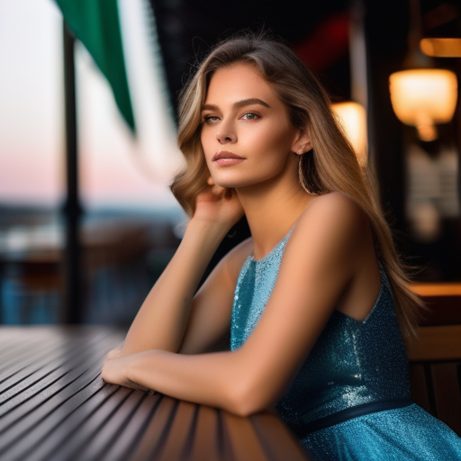

**Prompt**：

`masterpiece, best quality, greg rutkowski, fire, no humans, open mouth, wings, dragon, sharp teeth, teeth, tail, solo, breathing fire, horns, monster, claws, smoke , very detailed, high resolution, sharp, sharp image, 4k, 8k,`

Nagative Prompt：

`(deformed iris, deformed pupils), text, worst quality, low quality, jpeg artifacts, ugly, duplicate, morbid, mutilated, (extra fingers), (mutated hands), poorly drawn hands, poorly drawn face, mutation, deformed, blurry, dehydrated, bad anatomy, bad proportions, extra limbs, cloned face, disfigured, gross proportions, malformed limbs, missing arms, missing legs, extra arms, extra legs, (fused fingers), (too many fingers), long neck, camera`

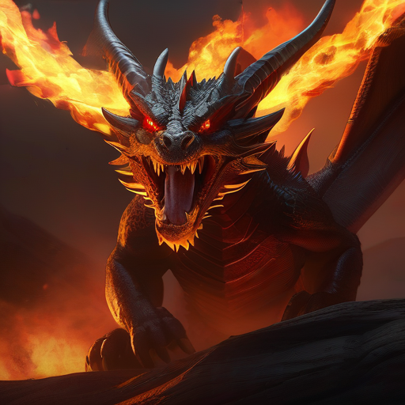

*Steps: 20, Sampler: Euler, CFG scale: 8, Seed: 5, Size: 512x512, Model hash: e6bb9ea85b, Model: sdXL_v10VAEFix, VAE hash: e6bb9ea85b, VAE: sdXL_v10VAEFix.safetensors, Version: v1.7.0*

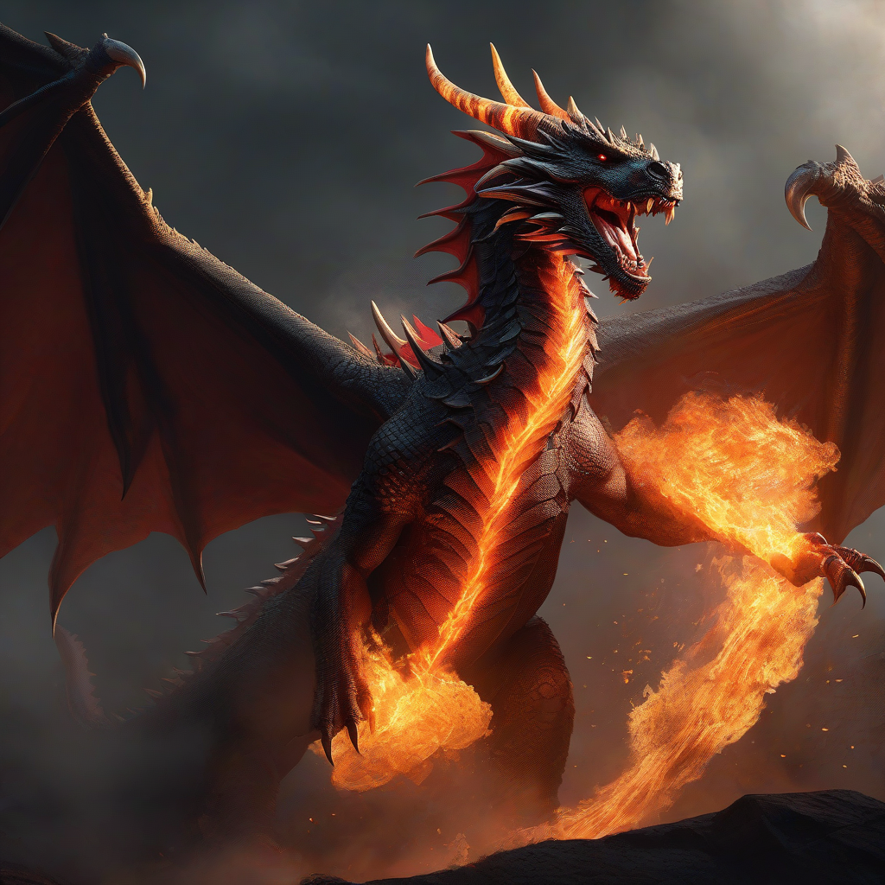

*Steps: 20, Sampler: Euler, CFG scale: 8, Seed: 3433749320, Size: 1024x1024, Model hash: e6bb9ea85b, Model: sdXL_v10VAEFix, VAE hash: e6bb9ea85b, VAE: sdXL_v10VAEFix.safetensors, Version: v1.7.0*

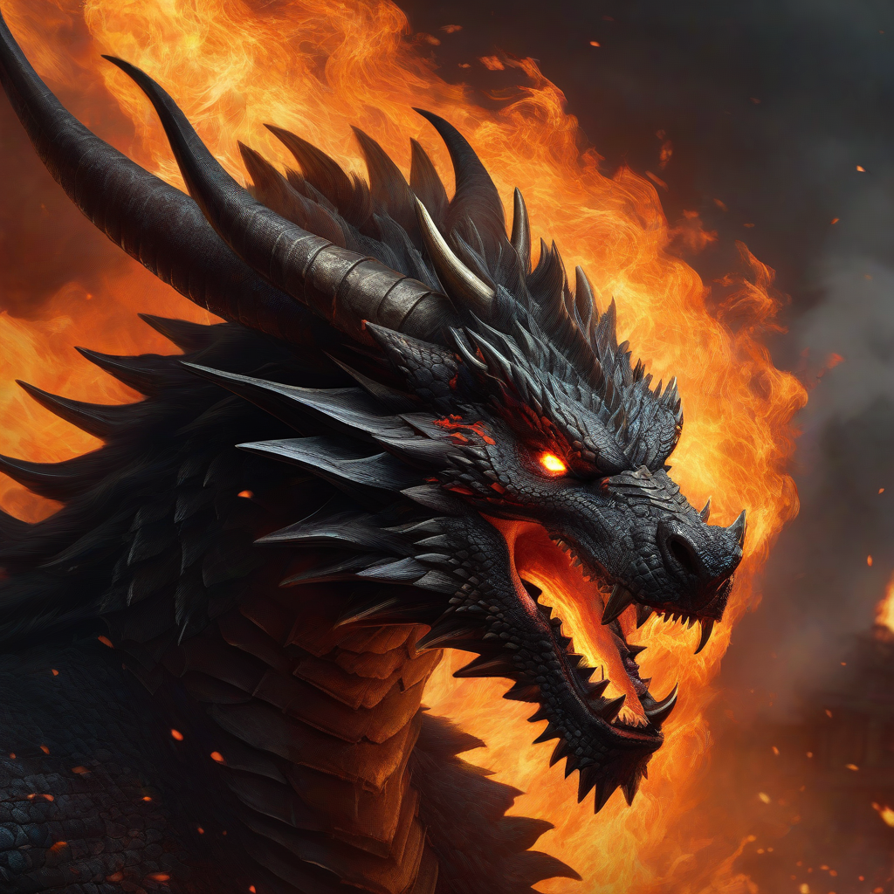

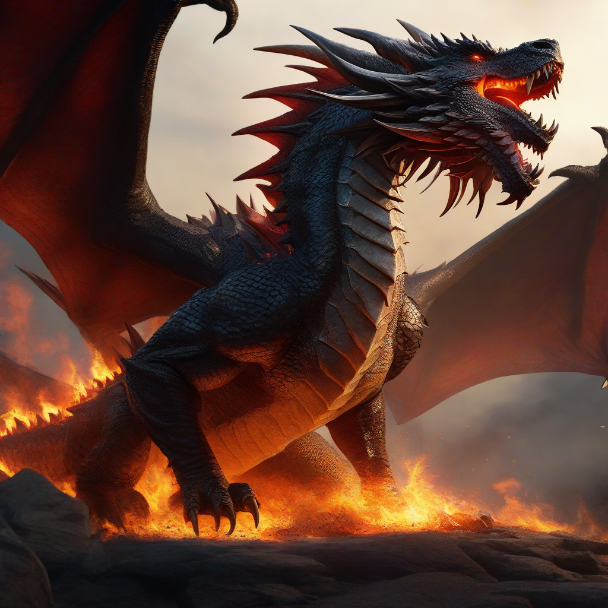

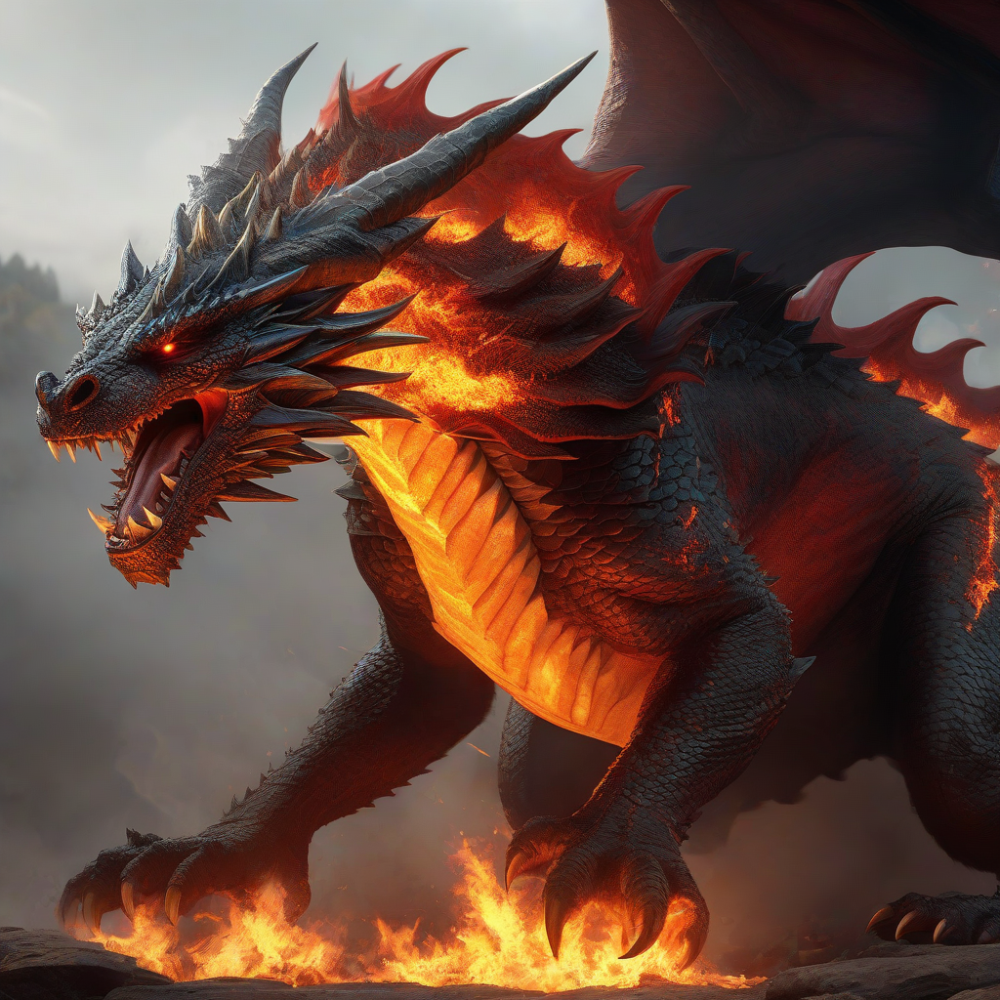

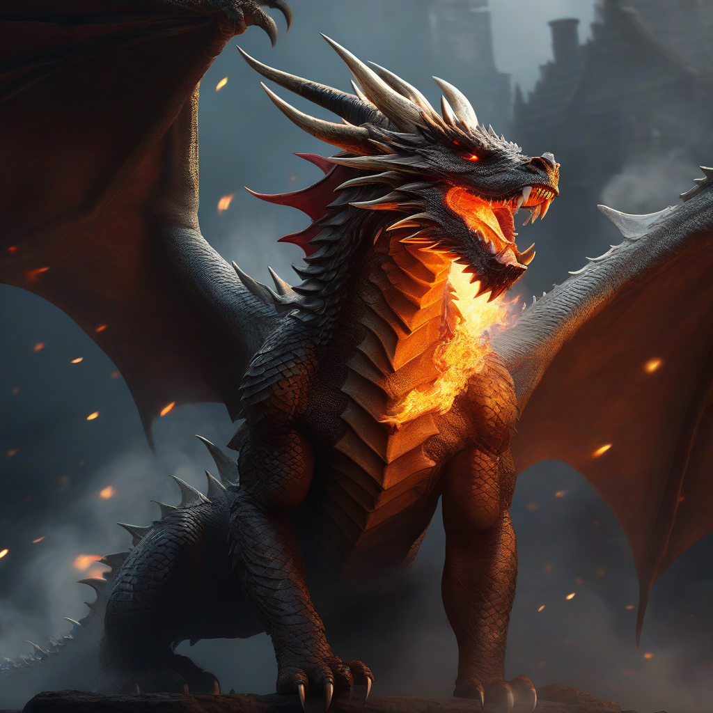