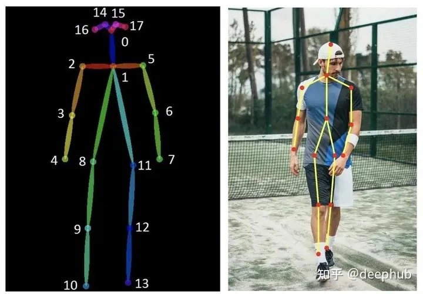

##  ControlNet 安装骨架动作绘图 

[Ivon的部落格](https://ivonblog.com/posts/stable-diffusion-webui-manuals/extensions/controlnet/)

如果你用过Stable Diffusion，可能已经注意到图像的输出有无限的结果可能性，就像在赌博一样，即使你输入了如此复杂和精心设计的提示，控制AI的能力仍然是有限的。所以我们就需要一种在最大大程度上能控制输出的方式。

ControlNet是斯坦福大学研究人员开发的Stable Diffusion的扩展，使创作者能够轻松地控制AI图像和视频中的对象。它将根据边缘检测、草图处理或人体姿势等各种条件来控制图像生成。ControlNet可以概括为一种简单的稳定扩散微调方法。

ControlNet是通过加入额外条件来控制扩散模型的神经网络结构，它可以让AI参考给定图片的动作/线条/景深，更精准的生成图片。

https://github.com/Mikubill/sd-webui-controlnet

克隆代码到本地，然后从本地安装。

安装完成后从 https://huggingface.co/lllyasviel/ControlNet-v1-1/tree/main 下载所有的pth文件，保存到 stable-diffusion-webui/extensions/sd-webui-controlnet/models 目录。

### 各個模型的用途 

ControlNet現有以下模型，您可以按照需求只下載需要的模型。

#### Anime Lineart 

偵測線條，生成的圖片亦會保留原始的線條，適合處理動漫圖像

#### Canny  

偵測圖片邊緣，比較模糊，不如Scribbles完整。

Canny通过使用边缘检测器创建高对比度区域的轮廓来检测输入图像。线条可以捕捉到非常详细的信息，但如果你的图像背景中有一些物体，它很可能会检测到不需要的物体。所以背景中物体越少效果越好。用于此预处理器的最佳模型是control_sd15_canny。

#### Depth   **& Depth Leres**

偵測輸入圖片的深度圖(depth map)。

这个预处理器有助于生成输入图像的深度估计。深度通常用于控制图像内物体的空间定位。浅色区域意味着它离用户更近，而深色区域则离用户更远。

在大图像时它可能会丢失图像内部的细节(面部表情等)。一般会与control_sd15_depth模型组合使用。Midas Resolution函数用于增加或减少detectmap中的大小和细节级别。它的级别越高，将使用更多的VRAM，但可以生成更高质量的图像，反之亦然。

Depth Leres有与Depth 相同的基本概念，但在地图中包含更广泛的范围。但有时它会从图片中捕获了太多信息，可能会生成与原始图像略有不同的图像。所以最好先试用两种预处理器，然后决定哪一种。

**HED (Holistically-Nested Edge Detection)**

Hed可以在物体周围创建清晰和精细的边界，输出类似于Canny，但减少了噪声和更柔软的边缘。它的有效性在于能够捕捉复杂的细节和轮廓，同时保留细节特征(面部表情、头发、手指等)。Hed预处理器可用于修改图像的风格和颜色。用于此预处理器的最佳模型是control_sd15_hed。

#### Illumination 

偵測輸入圖片的光源與照明效果。

#### Inpaint  

功能類似「內補繪製」，使用50%隨機遮罩＋50%隨機光流遮罩訓練而成。

#### Instruct Pix2Pix 

模型檔名為`ip2p`，類似「圖生圖」，但是使用訓練50%的指示(instruction)提示詞和50%的敘述(description)提示詞訓練而成。因為是ControlNet，使用此模型時不需要調整CFG Scale。

根據原作者的說法，此模型在下「使其成為X」的提示詞所生成的圖，效果比「使Y成為X」要好。

> Also, it seems that instructions like “make it into X” works better than “make Y into X”.

#### Lineart 

偵測線條，適合處理線稿，生成的圖片亦會保留原始的線條。

#### M-LSD **( Mobile Line Segment Detection)**

偵測輸入圖片的直線。MLSD Preprocessor 最适合生成强有力的线条，这些线条能够检测出需要独特和刚性轮廓的建筑和其他人造作品。但是它不适用于处理非刚性或弯曲的物体。MLSD适用于生成室内布局或建筑结构，因为它可以突出直线和边缘。用于此预处理器的最佳模型是control_sd15_mlsd。

#### Normal map

法线图使用了三种主要颜色(红、绿、蓝)，通过不同的角度来精确定位物体的粗糙度和光滑程度。它生成法线图的基本估计，可以保留相当多的细节，但可能会产生意想不到的结果，因为法线图完全来自图像，而不是在3D建模软件中构建的。

法线图有利于突出复杂的细节和轮廓，并且在定位对象方面也很有效，特别是在接近度和距离方面。“Normal Background Threshold”用于调整背景成分。设置一个更高的阈值可以移除背景的远处部分(将其混合成紫色)。降低阈值将命令AI保留甚至显示额外的背景元素。用于此预处理器的最佳模型是control_sd15_normal。

#### Openpose 

使用OpenPose技術偵測輸入圖片人物的動作，不一定會保留線條。

这个预处理器生成了一个基本的骨骼火柴人形象。 这种技术被广泛采用，因为多个 OpenPose 骨架可以组合成一个图像，这有助于引导稳定扩散生成多个一致的主题。 骨架图有很多关节点，。

要优化 OpenPose 的结果，建议上传一张人体图像（全身或半身）以及想要提取的姿势。 用于此预处理器的最佳模型是 control_sd15_openpose。

#### Scribbles 

偵測線條，偵測到的線條品質介於Soft Edge和Lineart之間。

涂鸦的目的是从简单的黑白线条画和草图生成图像。用户也可以使用“Canvas”选项创建特定大小的空白画布，用于手动素描（也可以直接上传图像）。如果草图和绘图由白色背景上的黑线组成，则需要选中“Invert Input Color”复选框。用于这个预处理器的最佳模型是control_sd15_openpose。

#### Segmentation 

模型檔名為`seg`，將偵測的圖片物件切成一個一個色塊處理，例如房子一個色塊，後面的天空一個色塊。

#### Shuffle 

把輸入圖片的概念轉移到生成的圖片。

作者給的例子：輸入灰色裝甲圖片，生成的鋼鐵人盔甲也會是灰色的。

#### Soft Edge 

偵測圖片邊緣，效果較為柔和，像用炭筆塗過。

#### Tile  

輸入圖片，選取一個區域，使其變清晰的模型。

开始使用

**prompt：**

`a chinese girl, black hair, red shirt, Blue Jeans， Red High Heels, watery eyes,(ultra high res,photorealistic,realistic,best quality,photo-realistic), (((high detailed skin))),(real person,photograph)`

**negative prompt:**

disfigured, ugly, bad, immature, cartoon, anime, 3d, painting, b&w

启用姿态openpos：

参考图

结果：

## 提示词工具 

https://github.com/DominikDoom/a1111-sd-webui-tagcomplete.git

https://github.com/byzod/a1111-sd-webui-tagcomplete-CN/ 中文

## 图片库浏览

https://github.com/yfszzx/stable-diffusion-webui-images-browser.git

## 骨架人偶 PoseX

https://github.com/hnmr293/posex.git

需要先安裝ControlNet才能使用這個擴充功能

PoseX是可以在Stable Diffuison WebUI直接拉人物骨架，再配合ControlNet生成姿勢的擴充功能。

開啟文生圖的頁面，點選右下角PoseX，點選Send this image to ControlNet

在下面的ControlNet，點選Enabled，preprocessor選取`none`，model選`openpose`，不需要上傳圖片。

回到上面的PoseX，調整人物姿勢。左鍵點選移動，滾輪放大縮小，對模型左鍵點二下即可用右鍵移動單個骨架。

## AI绘图转影片

https://github.com/Scholar01/sd-webui-mov2mov

需要先安裝ControlNet才能使用這個擴充功能

將影片逐一抽出畫格，使用ControlNet生圖，然後再自動合成新影片。可以設定輸出的畫格率，將人物單獨處理。

目前只有windows系统可以使用,如果您系统不支持,可以关闭该选项卡.

## 生成多个任务

https://github.com/ashen-sensored/stable-diffusion-webui-two-shot

nt Couple會分割繪圖時的提示詞，這樣就可以生成多重人物/物件，並精確指定位置顏色了。

像是先用PoseX拉好骨架，再使用Latent Couple標出人物的概略位置。

## 用文生图+ControlNet+Latent Couple生成指定位置的多个任务

於文生圖的界面會看到Latent Couple

勾選Enabled啟用，設定長寬，再點選最下面的`Create blank canvas`建立空白畫布

用滑鼠繪製色塊。例如用紅筆繪製一個人物，藍筆繪製另一個人物。

點選`I've finished my sketch`，下面就會顯示各個色塊的分割狀況。依序填入提示詞：在`General Prompt`填入畫風和背景的提示詞，藍筆部份填入貞德`Jeanne d'Arc`相關的提示詞，紅筆部份填入艾比蓋兒`Abigail Williams`的相關提示詞

點選`Prompt Info Update`，提示詞即會自動跑到上面的框框，再自行補上負向提示詞。

搭配事先用PoseX拉好的骨架，再點選Generate開始生圖。