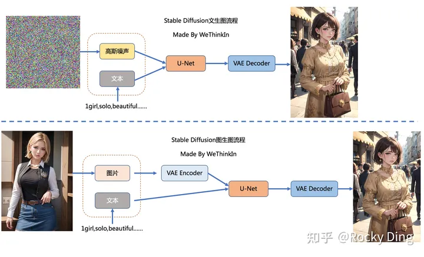

Stable Diffusion 基础

Stable Diffusion（SD）模型是由Stability AI和LAION等公司共同开发的**生成式模型**，总共有**1B左右的参数量**，可以用于文生图，图生图，图像inpainting，ControlNet控制生成，图像超分等丰富的任务

**文生图任务是指将一段文本输入到SD模型中**，经过一定的迭代次数，**SD模型输出一张符合输入文本描述的图片**

**而图生图任务在输入本文的基础上，再输入一张图片**，SD模型将根据文本的提示，**将输入图片进行重绘以更加符合文本的描述。**

我们需要给SD模型一个文本信息与机器数据信息之间互相转换的“桥梁”——CLIP Text Encoder模型。 我们使用CLIP Text Encoder模型作为SD模型的**前置模块**，将输入的人类文本信息进行编码，输出特征矩阵，这个特征矩阵与文本信息相匹配，并且能够使得SD模型理解，完成对文本信息的编码后，就会输入到SD模型的“图像优化模块”中对图像的优化进行“控制”。

如果是图生图任务，我们在输入文本信息的同时，还需要将原图片通过图像编码器（VAE Encoder）生成Latent Feature（隐空间特征）作为输入。

如果是文生图任务，我们只需要输入文本信息，再用random函数生成一个**高斯噪声矩阵作为**Latent Feature的“替代”输入到SD模型的“图像优化模块”中。

**“图像优化模块”作为SD模型中最为重要的模块，其工作流程是什么样的呢？**

首先，“图像优化模块”是由一个**U-Net网络**和一个**Schedule算法**共同组成，U-Net网络负责预测噪声，**不断优化生成过程，在预测噪声的同时不断注入文本语义信息**。而**schedule算法对每次U-Net预测的噪声进行优化处理（动态调整预测的噪声，控制U-Net预测噪声的强度）**，从而统筹**生成过程的进度**。在SD中，U-Net的迭代优化步数大概是50或者100次，在这个过程中Latent Feature的质量不断的变好（**纯噪声减少，图像语义信息增加，文本语义信息增加**）。 

U-Net网络和Schedule算法的工作完成以后，SD模型会将优化迭代后的Latent Feature输入到图像解码器（VAE Decoder）中，将Latent Feature重建成像素级图像。

我们对比一下文生图任务中，初始Latent Feature和经过SD的“图像优化模块”处理后，再用图像解码器重建出来的图片。

Latent Feature经过图像解码器重建后的图片是一个纯噪声图片。

经过SD的“图像优化模块”处理后，再用图像解码器重建出来的图片，可以看到是一个张包含丰富内容信息的有效图片。

Rocky再将其进行总结归纳制作成完整的Stable Diffusion前向推理流程图，方便大家更好的理解SD模型的前向推理过程：

1. **SD模型是生成式模型**，输入可以是图片，文本以及两者的结合，输出是生成的图片。
2. **SD模型属于扩散模型**，扩散模型的整体逻辑的特点是过程分步化与可迭代，这给整个生成过程引入更多约束与优化提供了可能。
3. **SD模型是基于Latent的扩散模型**，将输入数据压缩到Latent隐空间中，比起常规扩散模型，大幅提高计算效率的同时，降低了显存占用，成为了SD模型破圈的关键一招。
4. **站在CTO视角，将维度拉到最高维，Rocky认为SD模型是一个优化噪声的AI艺术工具。**

**Stable Diffusion的整个训练过程在最高维度上可以看成是如何加噪声和如何去噪声的过程，并在针对噪声的“对抗与攻防”中学习到生成图片的能力。**

Stable Diffusion整体的训练逻辑也非常清晰：

1. 从数据集中随机选择一个训练样本
2. 从K个噪声量级随机抽样一个timestep
3. 产生随机噪声
4. 计算当前所产生的噪声数据
5. 将噪声输入U-Net预测噪声
6. 计算产生的噪声和预测的噪声的L2损失
7. 计算梯度并更新SD模型参数

**语义信息对图片生成的控制**

SD模型在生成图片时，需要输入prompt，那么这些语义信息是如何影响图片的生成呢？

**答案非常简单：注意力机制。**

在SD模型的训练中，每个训练样本都会对应一个标签，我们将对应标签通过CLIP Text Encoder输出Text Embeddings，并将Text Embeddings以**Cross Attention**的形式与U-Net结构耦合，使得每次输入的图片信息与文字信息进行融合训练 

### 其他主流生成式模型介绍

在AIGC时代中，虽然SD模型已经成为核心的生成式模型之一，但是曾在传统深度学习时代火爆的GAN，VAE，Flow-based model等模型也跨过周期在SD模型身边作为辅助，发挥了巨大的作用。

GAN网络在AIGC时代依然发挥了巨大的作用，配合SD模型完成了很多算法工作流，比如：图像超分，脸部修复，风格迁移，图像编辑，图像fix，图像定权等。

所以Rocky在这里简单讲解一下GAN的基本原理，让大家做个了解。GAN由生成器G和判别器D组成。其中，生成器主要负责生成相应的样本数据，输入一般是由高斯分布随机采样得到的噪声Z。而判别器的主要职责是区分生成器生成的样本与 gt 样本，输入一般是 gt 样本与相应的生成样本，我们想要的是对 gt 样本输出的置信度越接近1越好，而对生成样本输出的置信度越接近0越好。与一般神经网络不同的是，**GAN在训练时要同时训练生成器与判别器，所以其训练难度是比较大的**。

我们可以将GAN中的生成器比喻为印假钞票的犯罪分子，判别器则被当作警察。犯罪分子努力让印出的假钞看起来逼真，警察则不断提升对于假钞的辨识能力。二者互相博弈，随着时间的进行，都会越来越强。在图像生成任务中也是如此，生成器不断生成尽可能逼真的假图像。判别器则判断图像是 gt 图像，还是生成的图像。**二者不断博弈优化**，最终生成器生成的图像使得判别器完全无法判别真假。

### VAE模型

在Stable Diffusion中，**VAE（变分自编码器，Variational Auto-Encoder）是基于Encoder-Decoder架构的生成模型**。VAE的Encoder（编码器）结构能将输入图像转换为低维Latent特征，并作为U-Net的输入。VAE的Decoder（解码器）结构能将低维Latent特征重建还原成像素级图像。

**Stable Diffusion中VAE的核心作用**

总的来说，**在Stable Diffusion中，VAE模型主要起到了图像压缩和图像重建的作用**

**为什么VAE可以将图像压缩到一个非常小的Latent space（潜空间）后能再次对图像进行像素级重建呢？**

因为虽然VAE对图像的压缩与重建过程是一个有损压缩与重建过程，但**图像全图级特征关联并不是随机的，它们的分布具有很强的规律性**：比如人脸的眼睛、鼻子、脸颊和嘴巴之间遵循特定的空间关系，又比如一只猫有四条腿，并且这是一个特定的生物结构特征。下面Rocky也使用VAE将图像重建成不同尺寸的生成图像，实验结论发现**如果我们重建生成的图像尺寸在512×512之上时，其实特征损失带来的影响非常小**。

**Stable Diffusion中VAE的高阶作用**

与此同时，VAE模型除了能进行图像压缩和图像重建的工作外，**如果我们在SD系列模型中切换不同微调训练版本的VAE模型，能够发现生成图片的细节与整体颜色也会随之改变（更改生成图像的颜色表现，类似于色彩滤镜）。**

### **SD模型整体架构初识**

**Stable Diffusion模型整体上是一个End-to-End模型**，主要由VAE（变分自编码器，Variational Auto-Encoder），U-Net以及CLIP Text Encoder三个核心组件构成。

在FP16精度下Stable Diffusion模型大小2G（FP32：4G），其中U-Net大小1.6G，VAE模型大小160M以及CLIP Text Encoder模型大小235M（约123M参数）。其中U-Net结构包含约860M参数，以FP32精度下大小为3.4G左右。

**Stable Diffusion中U-Net的核心作用**

在Stable Diffusion中，**U-Net模型是一个关键核心部分，能够预测噪声残差**，并结合Sampling method（调度算法：PNDM，DDIM，K-LMS等）对输入的特征矩阵进行重构，**逐步将其从随机高斯噪声转化成图片的Latent Feature**。

具体来说，在前向推理过程中，SD模型通过反复调用 U-Net，将预测出的噪声残差从原噪声矩阵中去除，得到逐步去噪后的图像Latent Feature，再通过VAE的Decoder结构将Latent Feature重建成像素级图像。

**Rocky再从AI绘画应用视角解释一下SD中U-Net的原理与作用。**其实大家在使用Stable Diffusion WebUI时，点击Generate按钮后，页面右下角图片生成框中展示的从噪声到图片的生成过程，其中就是U-Net在不断的为大家去除噪声的过程。到这里大家应该都能比较清楚的理解U-Net的作用了。

Stable Diffusion中的U-Net，在传统深度学习时代的Encoder-Decoder结构的基础上，**增加了ResNetBlock（包含Time Embedding）模块，Spatial Transformer（SelfAttention + CrossAttention + FeedForward）模块以及CrossAttnDownBlock，CrossAttnUpBlock和CrossAttnMidBlock模块**。

**ResNetBlock模块**

在传统深度学习时代，ResNet的残差结构在图像分类，图像分割，目标检测等主流方向中几乎是不可或缺，**其简洁稳定有效的“残差思想”终于在AIGC时代跨过周期，在SD模型的U-Net结构中继续繁荣**。

值得注意的是，**Time Embedding正是输入到ResNetBlock模块中，为U-Net引入了时间信息（时间步长T，T的大小代表了噪声扰动的强度），模拟一个随时间变化不断增加不同强度噪声扰动的过程，让SD模型能够更好地理解时间相关性**。

同时，在SD模型调用U-Net重复迭代去噪的过程中，我们希望在迭代的早期，能够先生成整幅图片的轮廓与边缘特征，随着迭代的深入，再补充生成图片的高频和细节特征信息。**由于在每个ResNetBlock模块中都有Time Embedding，就能告诉U-Net现在是整个迭代过程的哪一步，并及时控制U-Net够根据不同的输入特征和迭代阶段而预测不同的噪声残差**。

**Rocky再从AI绘画应用视角解释一下Time Embedding的作用。**Time Embedding能够让SD模型在生成图片时考虑时间的影响，使得生成的图片更具有故事性、情感和沉浸感等艺术效果。并且Time Embedding可以帮助SD模型在不同的时间点将生成的图片添加完善不同情感和主题的内容，从而增加了AI绘画的多样性和表现力。

**CrossAttention模块**

**Spatial Transformer模块不改变输入输出的尺寸，只在图片对应的位置上融合了语义信息，所以不管是在传统深度学习时代，还是AIGC时代，Spatial Transformer都是将本文与图像结合的一个“万金油”模块**。

看CrossAttention模块的结构图，大家可能会疑惑**为什么Context Embedding用来生成K和V，Latent Feature用来生成Q呢？**

原因也非常简单：因为在Stable Diffusion中，主要的目的是想把文本信息注入到图像信息中里，所以用图片token对文本信息做 Attention实现逐步的文本特征提取和耦合。

**Rocky再从AI绘画应用视角解释一下CrossAttention模块的作用。**CrossAttention模块在AI绘画应用中可以被视为一种连接和表达的工具，它有助于在输入文本和生成图片之间建立联系，创造更具深度和多样性的艺术作品，引发观众的思考和情感共鸣。CrossAttention模块可以将图像和文本信息关联起来，就像艺术家可以将不同的元素融合到一幅作品中，这有助于在创作中实现不同信息之间的协同和互动，产生更具创意性的艺术作品。再者CrossAttention模块可以用于将文本中的情感元素传递到生成图片中，这种情感的交互可以增强艺术作品的表现力和观众的情感共鸣。

**BasicTransformer Block模块**

BasicTransformer Block模块是在CrossAttention子模块的基础上，增加了SelfAttention子模块和Feedforward子模块共同组成的，**并且每个子模块都是一个残差结构**，这样**除了能让文本的语义信息与图像的语义信息更好的融合之外，还能通过SelfAttention机制让模型更好的学习图像数据的特征**。

首先，在Stable Diffusion U-Net的SelfAttention模块中，**输入只有图像信息，所以SelfAttention主要是为了让SD模型更好的学习图像数据的整体特征**。

再者，**SelfAttention可以将输入图像的不同部分（像素或图像Patch）进行交互，从而实现特征的整合和全局上下文的引入，能够让模型建立捕捉图像全局关系的能力，有助于模型理解不同位置的像素之间的依赖关系，以更好地理解图像的语义。**

在此基础上，**SelfAttention还能减少平移不变性问题**，SelfAttention模块可以在不考虑位置的情况下捕捉特征之间的关系，因此具有一定的平移不变性。

**Rocky再从AI绘画应用视角解释一下SelfAttention的作用。**SelfAttention模块可以让SD模型在图片生成过程中捕捉内在关系、创造性表达情感和思想、突出重要元素，并创造出丰富多彩、具有深度和层次感的艺术作品。

**Spatial Transformer模块**

更进一步的，在BasicTransformer Block模块基础上，加入GroupNorm和两个卷积层就组成Spatial Transformer模块。Spatial Transformer模块是SD U-Net中的核心Base结构，Encoder中的CrossAttnDownBlock模块，Decoder中的CrossAttnUpBlock模块以及CrossAttnMidBlock模块都包含了大量的Spatial Transformer子模块。

### **CLIP Text Encoder模型**

**作为文生图模型，Stable Diffusion中的文本编码模块直接决定了语义信息的优良程度，从而影响到最后图片生成的多样性和可控性。**

在这里，**多模态领域的神器——CLIP（Contrastive Language-Image Pre-training）**，跨过了周期，从传统深度学习时代进入AIGC时代，成为了SD系列模型中文本和图像之间的连接通道。**并且从某种程度上讲，正是因为CLIP模型的前置出现，更加快速地推动了AI绘画领域的繁荣**。

首先，**CLIP模型是一个基于对比学习的多模态模型，主要包含Text Encoder和Image Encoder两个模型**。其中Text Encoder用来提取文本的特征，可以使用NLP中常用的text transformer模型作为Text Encoder；而Image Encoder主要用来提取图像的特征，可以使用CNN/vision transformer模型（ResNet和ViT）作为Image Encoder。**与此同时，他直接使用4亿个图片与标签文本对数据集进行训练，来学习图片与本文内容的对应关系。**

与U-Net的Encoder和Decoder一样，CLIP的Text Encoder和Image Encoder也能非常灵活的切换；其庞大图片与标签文本数据的预训练赋予了CLIP强大的zero-shot分类能力。

**灵活的结构，简洁的思想，让CLIP不仅仅是个模型，也给我们一个很好的借鉴，往往伟大的产品都是大道至简的。更重要的是，CLIP把自然语言领域的抽象概念带到了计算机视觉领域**

CLIP在训练时，从训练集中随机取出一张图片和标签文本。CLIP模型的任务主要是通过Text Encoder和Image Encoder分别将标签文本和图片提取**embedding向量**，然后用**余弦相似度（cosine similarity）**来比较两个embedding向量的**相似性**，以判断随机抽取的标签文本和图片是否匹配，并进行梯度反向传播，不断进行优化训练。

完成CLIP的训练后，**输入配对的图片和标签文本，则Text Encoder和Image Encoder可以输出相似的embedding向量**，计算余弦相似度就可以得到接近1的结果。**同时对于不匹配的图片和标签文本，输出的embedding向量计算余弦相似度则会接近0**。

**就这样，CLIP成为了计算机视觉和自然语言处理这两大AI方向的“桥梁”，AI领域的多模态应用有了经典的基石模型。**

**上面我们讲到CLIP模型主要包含Text Encoder和Image Encoder两个模型**，在Stable Diffusion中主要使用了Text Encoder模型。**CLIP Text Encoder模型将输入的文本Prompt进行编码，转换成Text Embeddings（文本的语义信息）**，通过前面一章节提到的U-Net网络中的**CrossAttention模块嵌入Stable Diffusion中作为Condition，对生成图像的内容进行一定程度上的控制与引导**，目前SD模型使用的的是[CLIP ViT-L/14](https://huggingface.co/openai/clip-vit-large-patch14)中的Text Encoder模型。

CLIP ViT-L/14 中的Text Encoder是只包含Transformer结构的模型，一共由12个CLIPEncoderLayer模块组成，模型参数大小是123M，具体CLIP Text Encoder模型结构如下图所示。其中特征维度为768，token数量是77，**所以输出的Text Embeddings的维度为77x768**。