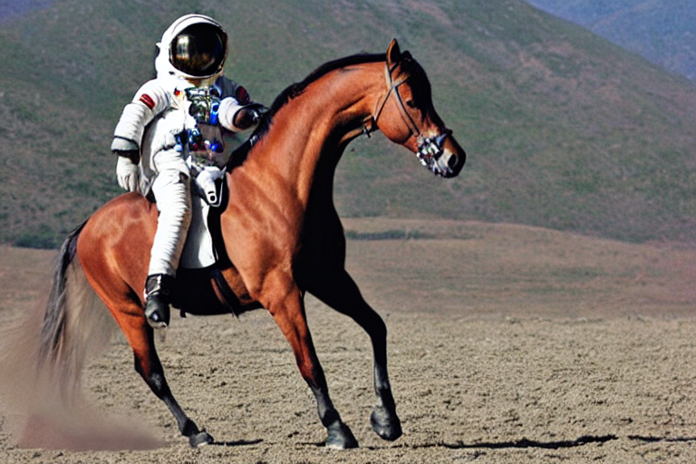
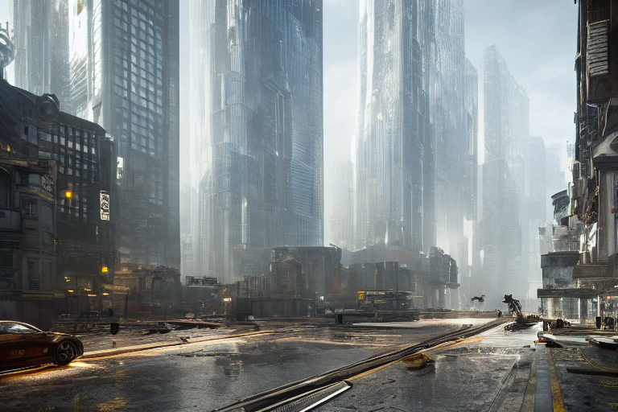

20240218-用diffusers搭建stable diffusion

参照  [diffusers api](https://huggingface.co/docs/diffusers/api/pipelines/stable_diffusion/text2img#diffusers.StableDiffusionPipeline.__call__.negative_prompt)

```
conda create -n dfu python=3.10.13
conda activate dfu


pip install diffusers --upgrade -i https://pypi.tuna.tsinghua.edu.cn/simple some-package

pip install transformers==4.27.0 accelerate==0.12.0 invisible_watermark -i https://pypi.tuna.tsinghua.edu.cn/simple some-package

conda install jupyter


pip install diffusers transformers scipy ftfy 

pip install git+https://github.com/huggingface/accelerate

```

```
#读取diffuers库
from diffusers import StableDiffusionPipeline

#初始化SD模型，加载预训练权重
pipe = StableDiffusionPipeline.from_pretrained("runwayml/stable-diffusion-v1-5")
#使用GPU加速
pipe.to("mps")
```


```
#接下来，我们就可以运行pipeline了
prompt = "a photograph of an astronaut riding a horse"
# Number of denoising steps
steps = 25         

# Scale for classifier-free guidance
CFG = 7.5
image = pipe(prompt, guidance_scale=CFG, height=512, width=768, num_inference_steps=steps).images[0]

# 由于没有固定seed，每次运行代码，我们都会得到一个不同的图片。
display(image)
```



```
prompt = "city future, 8k, exploration, cinematic, realistic, unreal engine, hyper detailed, volumetric light, moody cinematic epic concept art, realistic matte painting, hyper photorealistic"
negative_prompt ="lowres, bad anatomy, text, error, extra digit, fewer digits, cropped, worst quality, low quality, normal quality, jpeg artifacts,signature, watermark, username, blurry, artist name"
steps = 20         

result1 = pipe(prompt=prompt,negative_prompt=negative_prompt, guidance_scale=CFG, height=512, width=768, num_inference_steps=steps)
image1 = result1.images[0]

# 由于没有固定seed，每次运行代码，我们都会得到一个不同的图片。
display(image1)
```

