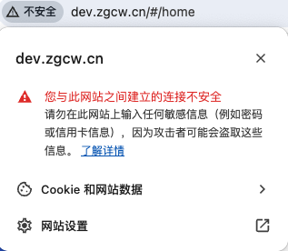

解决 访问http自动跳转到https的问题

先访问http域名，然后点击地址栏所测那个“不安全”的警告，弹出对话框中选择网站设置，

然后再下面的不安全内容后面的下拉框中选择**允许**

 

在地址栏输入: chrome://net-internals/#hsts

找到底部Delete domain security policies一栏，输入想处理的域名，点击delete。

搞定了，再次访问http域名不再自动跳转https了。